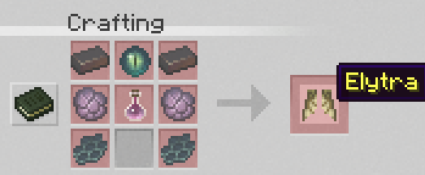
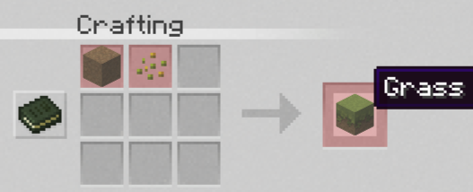

# Items / Blöcke / Rezepte

### <mark style="background-color:blue;">Custom Moonexpansion Items</mark>

Vanilla erweiternde Items die gefunden oder gecraftet werden können!

#### Xp Splitter:

Diese überall in Custom Strukturen zu findenden Scherben können dir beim verbrauchen Erfahrungspunkte geben.

#### Oxidationspuder:

Wenn du mit diesen Puder auf ein Kupferblock haust beschleunigst du das oxidieren. Ein sehr nützliches Item das dir viel Zeit einsparen kann.

#### Greifhaken:

Mit diesen Tool können hohe Berge oder weite Entfernungen schneller überwunden werden.

#### Home Locator:

Mit den Home Locator kannst du dir die Koordinaten anzeigen lassen wenn du deine Base verloren hast. Sehr nützlich besonders am Anfang.

#### Levitation Potion:

Die Levitation Potion gibt dir wie der Name sagt den Levitations Effekt den du wie im End durch Shulker erhältst. Damit kannst du höher gelegene Orte erreichen ohne das du dich hoch bauen musst. Der Effekt kann zudem wann du es magst mit einer Sneak Bewegung deaktiviert werden. Der Trank ist nur in Custom Pyramiden zu finden.


### <mark style="background-color:purple;">Besondere Items</mark>

Items/Drops die entweder in besonderen Strukturen gefunden werden müssen oder von speziellen Mobs droppen.&#x20;

#### Cherry Grove Schwert:

Das Grove Schwert kann nur in den neuen Cherry Grove Biom gefunden werden. Es kann verschiedene Enchantements und Werte haben. Außerdem hat es einzigartige Particle Effekte.

#### Shiny Items

Die Shiny Items sind besondere Items die einmalig in Strukturen gefunden werden können. Sie haben besondere Eigenschaften und Partikel Effekte.

```
Shiny Edition: Shiny Spyglass / Shiny Turtlehelm / Shiny Shield
```

#### Dune Strider Boots

Diese Schuhe können in Custom Pyramiden gefunden werden und geben dir auf Sand einen Schnelligkeits Effekt (II).

### Neue Vanilla Rezepte

<figure><figcaption><p>Elytra Rezept</p></figcaption></figure>

<figure><figcaption><p>Grasblock Rezept</p></figcaption></figure>
