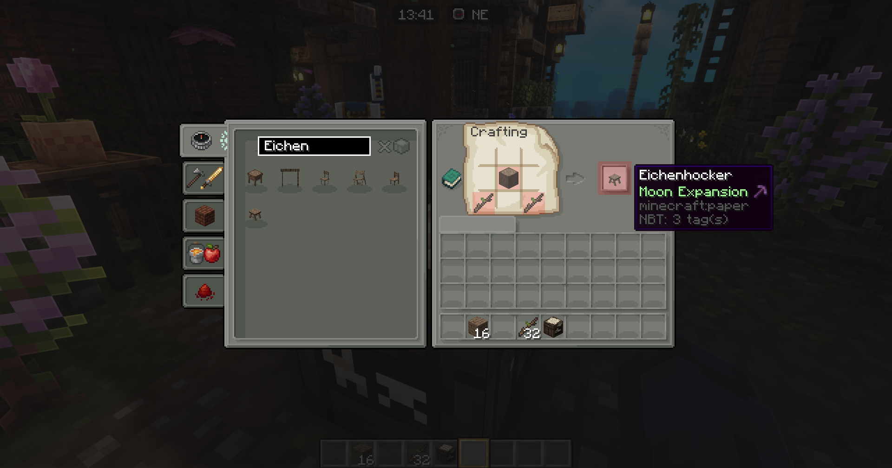

# Möbel/Dekorationen

Auf unseren Server gibt es die Möglichkeit Möbel/Dekoration und Schränke zu erhalten. Diese von uns ins Spiel eingebrachten Möbel können wie auch alles andere in der Werkbank hergestellt werden.

### Vielfältigkeit für euch!

Anders wie auf anderen Servern haben fast alle Möbel die Vanilla Texture des jeweiligen Holzes. Einen kleinen Effekt bietet uns dieses Feature den als einziger Server (uns bekannter Server) passt sich die Texture vom Holz der Möbel euren gespielten Texturepack an so das jedes Möbelstück einzigartig zu euren Texturepack passt.

Um das Rezept für die Möbel zu finden suche dazu mit den unten stehenden Namen in der Werkbank. Oder suche direkt nach zb. - Eichenholzstuhl /tisch etc

```
Stickworte:  Stuhl / Tisch / Sofa / Deks
```

<mark style="background-color:green;">In Möbeln mit einer Schublade können Items wie in einer Kiste hinterlegt werden!</mark>


Wir empfehlen mit Optifine und oder Forge/Fabric zu spielen da es mit Clients zu ungewollten Bugs kommen **KANN**. Wir arbeiten aber kontinuierlich an Lösungen.


<figure><figcaption><p>Beispiel zur Suche der Möbel in der Werkbank.</p></figcaption></figure>

<figure><figcaption><p>Möbel aus den letzten Moon Expansion Update 1.19.4/z. 2 Wochen vor den 1.20 Update wurden bereits die Inhalte für das neue Minecraft Update auf Moonrealms hinzugefügt. So können Spieler stets Pünktlich zum realeas neue Features erwarten.</p></figcaption></figure>

