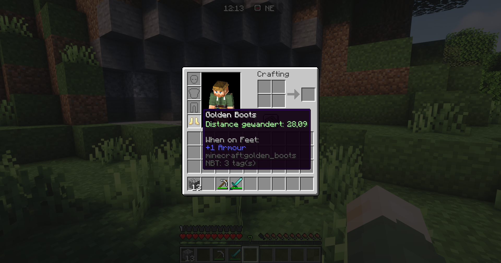
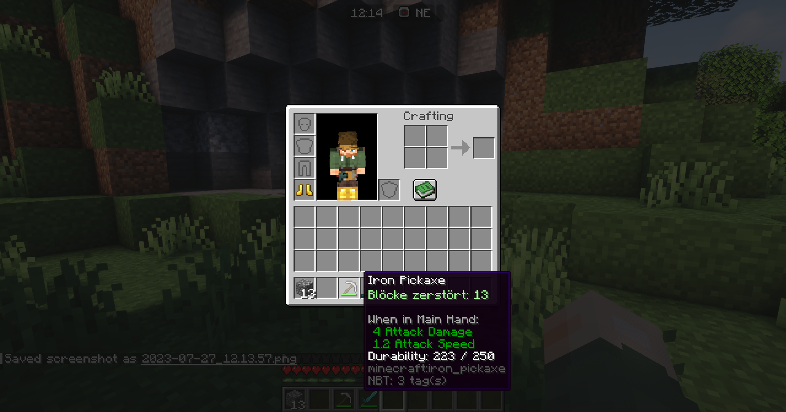

# Item Statistiken

Mit einen Stats Enchantement lasse sich auf viele Rüstung und Tools Statistiken anzeigen. Diese können dir bestimmte Werte deiner Ausrüstung anzeigen um zb. zu sehen wie viele Steine du mit deiner Spitzhacke abgebaut hast.

Um einen gewissen tausch Anreiz zu schaffen haben Items mit besonders hohen Statistiken einen höheren Wert.

### Anleitung

* Kaufe ein Stats Enchantement bei den Händler Bennet im Hauptdorf.
* Nimm das Item was verzaubert werden soll in die Hand.
* Klicke wieder auf den Npc und wähle im Menü den Amboss.
* Jetzt lege das Enchantment in das geöffnete Gui und WOHLAA
* Dein Item wurde verzaubert!

<figure><figcaption></figcaption></figure>

 

<figure><figcaption></figcaption></figure>

