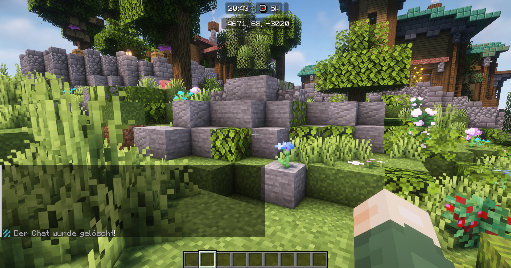

# Mechaniken

### Kleinere Mechaniken

* Kaputter Amboss mit Eisen Blöcken reparieren.
* Shulkerboxen öffnen ohne sie zu platzieren (sneak+click).
* Rüstungsständer wie auf der Bedrock Version bearbeiten und posieren. (Ziele dabei mit den Croos auf die Druckplatte)
* Ui/Tooltips zb. wird dir angezeigt welches Essen dir wie viele Hungerkeulen einbringt.
* Ui/Tooltips: Es wird dir bei VZ Büchern angezeigt welches Enchantment für welche Ausrüstungs  Tool sie ist.

### Custom Huds like Clients

Um dir einige hilfreiche Informationen wie die Koordinaten und den aktuellen Chunk Owner uvm anzeigen zu lassen hast du die Möglichkeit in den Einstellungen (/settings) eine Hud Leiste zu aktivieren. Du kannst sogar die Inhalte der Leiste wie du magst anpassen.

<figure><figcaption>
Beispiel zur Hudleiste
</figcaption></figure>

 

<figure><figcaption>
Beispiel zur Hudleiste
</figcaption></figure>

### Gameplay Mechaniken

* Mit einer minimalen Wahrscheinlichkeit können lootbare Schweine mit einen Fass auf der Karte spawnen diese droppen dann normale bis wertvolle Items.
* Wenn du stirbst werden deine Items und deine Xp in einen Deathbarrel gelagert. So hast du eine Chance deine Items wieder zu erlangen. Aber Achtung! andere Spieler können dein Barrel ebenfalls öffnen.
* Jede Vanilla und nicht Vanilla Struktur ist pro Spieler lootbar so das jeder Spieler die Chance hat selber jede Struktur zu looten.
* Verbessertes Inventar Management (unrealeased).

<figure><figcaption>
Lootbares Schwein
</figcaption></figure>

 

<figure><figcaption>
Deathbarrel
</figcaption></figure>

