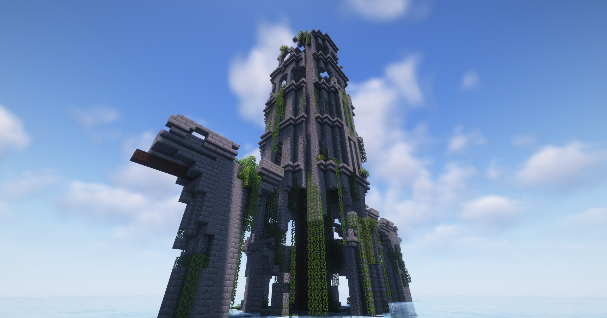
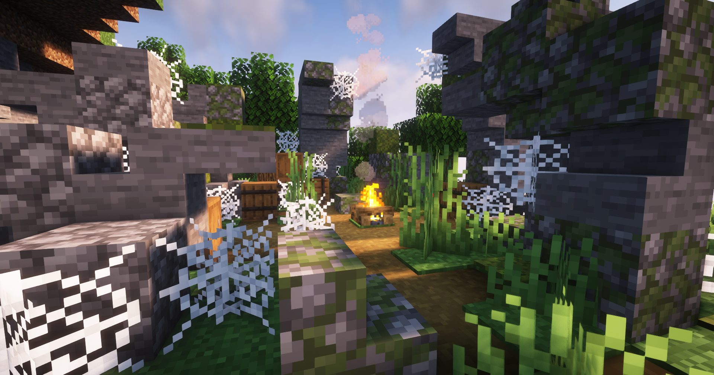
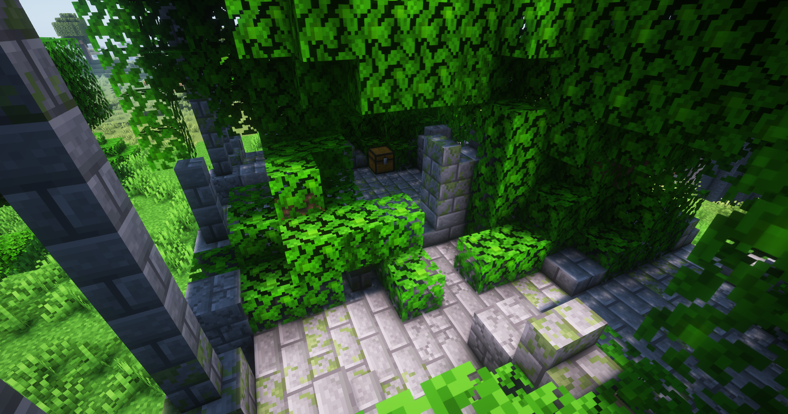

# Neue Strukturen / Biome

### Dome Dungeon Ruine

Die Dome Dungeon Ruinen sind mittel bis hohe Türme. Sie beherbergen oft viele gefährliche Mobs. Dort finden sich aber auch häufiger sehr wertvolle Items.

<figure><figcaption><p>Moonrealms Expansion</p></figcaption></figure>

### Redwood Forest Biome

Ein Mystischer Ort mit roten hohen Bäumen und der einzige Ort wo sonst noch Pilzkühe heimisch sind.

```
Moonrealms Original Expansion
```

### Deko Köpfe Handelsposten

Bei diesen Außenposten der sich auf verschiedene Orte der Karte befindet, können Dekorationsköpfe gekauft werden. Diese Köpfe sind von Ort zu Ort unterschiedlich.

```
Moonrealms Original Expansion
```

### Cherry Blossom Relikt

Bei dieser Antiken Stätte kannst du das Antike Cherry Grove Schwert finden.

```
Moonrealms Original Expansion
```

### Verwucherte Ruinen

Verwucherte Ruinen lassen sich auf der ganzen Karte finden und sehen von Biome zu Biome verschieden aus. Auch hier lassen sich Kisten und Rüstungsständer looten.

<div>

<figure><figcaption><p>Expansion by Botany</p></figcaption></figure>

 

<figure><figcaption><p>Expansion by Botany</p></figcaption></figure>

</div>



Diese Seite befindet sich aktuell in Bearbeitung!

