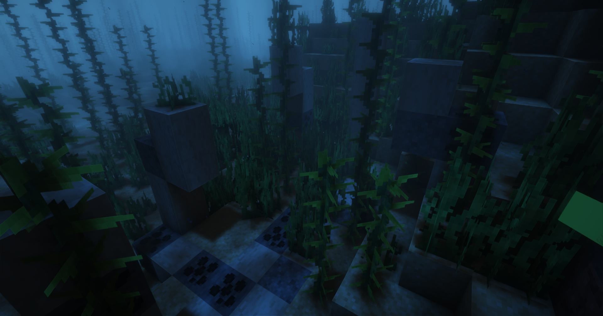
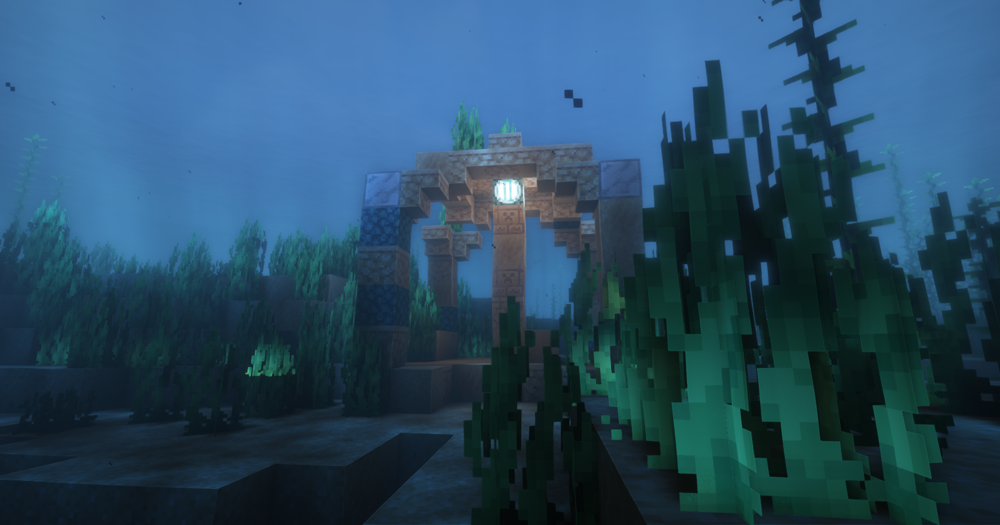
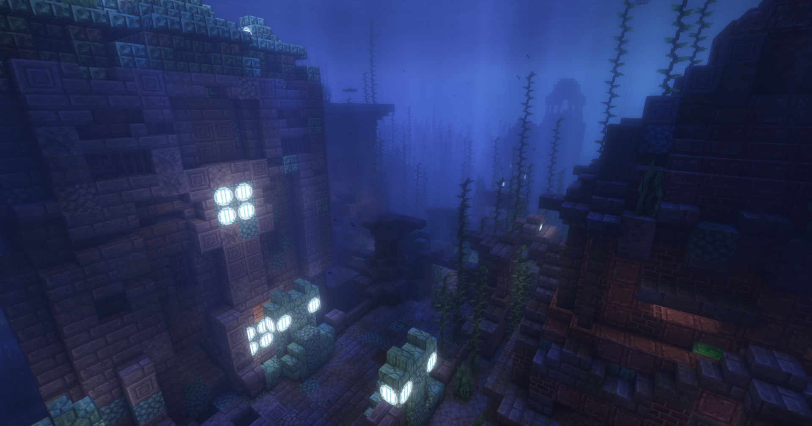

# Neue Strukturen

### Oberwelt Updates

Die Oberwelt wurde nicht nur mit einigen neuen Strukturen ergänzt. Auch die einzelnen Biome wurde etwas durch eine neue Generierung verschönert. So gibt es umgestürzte Bäume, Steinhaufen und für mehr Abwechslung auch Moos. Trotzdem ist sie der Vanilla Umgebung treu geblieben.

### Dome Dungeon Ruine

Die Dome Dungeon Ruinen sind mittel bis hohe Türme. Sie beherbergen oft viele gefährliche Mobs. Dort finden sich aber auch häufiger sehr wertvolle Items.

### Deko Köpfe Handelsposten

Bei diesen Außenposten der sich auf verschiedene Orte der Karte befindet, können Dekorationsköpfe gekauft werden. Diese Köpfe sind von Ort zu Ort unterschiedlich.

```
Moonrealms Original Expansion
```

### Verwucherte Ruinen

Verwucherte Ruinen lassen sich auf der ganzen Karte finden und sehen von Biome zu Biome verschieden aus. Auch hier lassen sich Kisten und Rüstungsständer looten.

<div>

<figure><figcaption><p>Expansion by Botany</p></figcaption></figure>

 

<figure><figcaption><p>Expansion by Botany</p></figcaption></figure>

</div>

### Ocean Ruinen und Tempel

Auch im Ocean hat sich etwas getan. Zerstörte Ruinen und große Tempelanlagen warten dort auf dich. Mit viel wertvollen Loot und eine Menge zu Entdecken werden diese Gebiete aber auch von stärkeren ertrunkenen Zombies und Wächtern beschützt. Wer hier plündern möchte sollte sich vorher gut ausrüsten.

<div>

<figure><figcaption><p>Ruine</p></figcaption></figure>

 

<figure><figcaption><p>Tempel</p></figcaption></figure>

 

<figure><figcaption><p>Ocean Städte</p></figcaption></figure>

</div>
