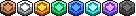

# Spielzeitmedaillen

Um unsere Spieler zu motivieren Fortschritte zu sammeln gibt es die sogenannten Medaillen. Diese sind kleine Icons die in der Tab hinter deinen Namen angezeigt werden und die deine Spielzeit/Erfahrung symbolisieren.

Spielzeit Medaillen erhält jeder Spieler der eine gewisse Spielzeit erreicht hat. Alle Medaillen findet man unter den Command /playtime von dort aus können auch die Belohnungen geclaimt werden die es für eine gewisse Spielzeit gibt.

Je höher deine Spielzeit ist desto wertvoller werden deine Belohnungen wenn du sie erreichts.

**Diese Medaillen gibt es derzeit**: Kupfer, Eisen, Gold, Emerald, Lapis, Diamond, Amehtyst, Netherite

<figure><figcaption></figcaption></figure>
