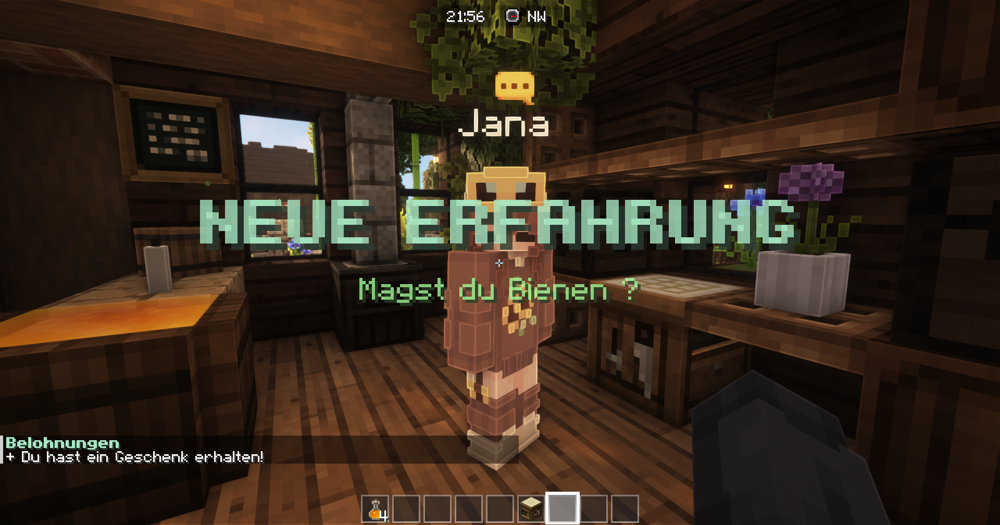

# Advancements/Quests

Bei Npcs in Heimatdörfern lassen sich kleine Quests annehmen die dir Belohnungen einbringen. Einige Npcs lassen dir aber auch ganz neue Dinge wie das Luftreisen lernen wenn du sie mit Quests freischaltest.&#x20;

Nach abschließen aller verfügbaren Quests für einen Npc erhältst du ein Npc Advancement für das erreichen.

Einige Npcs in Heimatdörfern wie den Imker bieten wiederkehrende Aufgaben an die an einen Aufgabenbrett angenommen werden können. Nach erreichen einer bestimmten Stufe erhältst du eine Trophäe.

Deine bereits bekommenen Advancements und Trophäen werden dir im Menu unter "Advancements" angezeigt.

<figure><figcaption>
Beispiel für ein gefundenes Advancement
</figcaption></figure>
