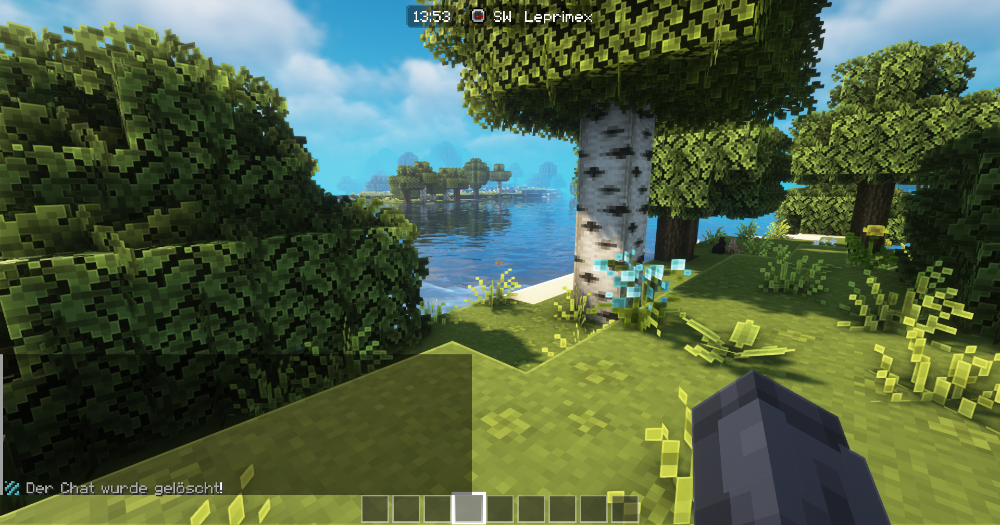

# Chunk Claiming

Auf unserer Welt können Grundstücke in Form von Chunks geclaimt werden. Das heißt jedes Grundstück ist 16x16 Blöcke (ein Chunk) groß. Natürlich können aber auch mehrere Chunks neben einander erstellt werden so dass man ein größeres Grundstück erhält.

Weitere Chunks erhältst du indem du sie mit Xp Level kaufst.

**Chunk Claiming Commands**&#x20;

* `/chunk claim:`  Claim den Chunk auf den du stehst.
* `/chunk trust:` Truste einen Freund auf deinen Chunk.
* `/chunk untrust:` Untruste einen Freund auf deinen Chunk.
* `/chunk show:` Lass dir die Chunk Grenzen mit Partikeln anzeigen.
* `/chunk list:` Liste alle Chunks auf die dir gehören.

Wenn du im Einstellungsmenü das Hudmod Element "Region" aktiviert hast. Wird dir in der Hud Leiste der Owner des Chunks angezeigt auf den du dich grade befindest.

<figure><figcaption></figcaption></figure>
