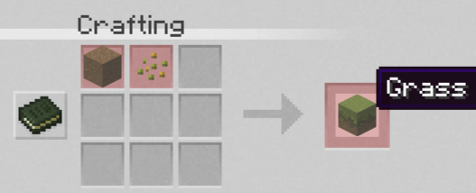

# Items / Blöcke / Rezepte


Dieser Eintrag wird aktuell überarbeitet. Die meisten anderen Items und Blöcke werden neu eingetragen!


<mark style="background-color:purple;">Items/Drops die entweder in besonderen Strukturen gefunden werden müssen oder von speziellen Mobs droppen.</mark>&#x20;

**Papageienfeder**: Mobdrop eines Papageien

**Wolfszahn**: Mobdrop eines Wolfes

**Muscheln**: Kann geangelt und von Ertrunkenen gedroppt werden. Wenn die Muscheln im Verarbeitungstisch verarbeitet werden bekommt man daraus Perlen.&#x20;

* Perlen dienen als Trading Währung für Npcs

**Birkenhartz**: Dropt beim abbauen von Birkenholz als Nebenprodukt.

**Witherdust**: Mobdrop eines Withers

**Kuhmist**: Kann ebenfalls als Dünger für Pflanzen verwendet werden.

**Phantomfeder**: Mobdrop eines Phantoms

<mark style="background-color:blue;">Besondere Items und Blöcke</mark>

**Verarbeitungstisch**: Mit einen Verarbeitungstisch lassen sich Vanilla erweiternde Items verwerten. Diese verwerteten Items werden oft für andere Rezepte oder Items verwendet.

**Schneebogen**: Der Schneebogen ist ein seltenes Tool und nicht so leicht zu bekommen. Wenn man mit ihn auf Gegner schießt bekommen diese den Eis Effekt.

**Korallenschwert**: Das Korallenschwert ist ein seltenes Schwert. Wenn ein Gegner mit den Schwert getroffen wird bekommt dieser den Gift Effekt.

**Glowing Horn**: Ein Pfiff aus diesen Horn bringt Monster auch in den dunkelsten Höhlen zum leuchten.,

**Dunestriderboots**: Geben dir auf Sand einen Schnelligkeits Effekt wenn du sie benutzt. Können bei einen Relict Toolsmith erworben werden.

**Knochenspeer**: Mit diesen Speer kannst du so richtig auf die Jagd gehen.

**Trank der Effektbindung**: Hebt beim trinken schlechte Statuseffekte wieder auf.

**Sniffer Rucksack**: Ein Rucksack der aus Snifferpflanzen hergestellt werden kann.

### Neue Vanilla Rezepte

<figure><figcaption>
Grasblock Rezept
</figcaption></figure>
