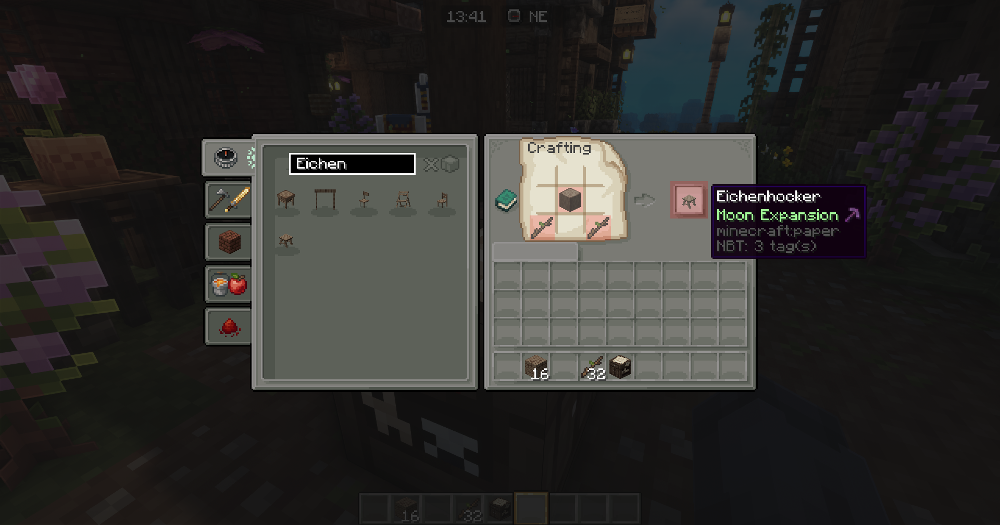
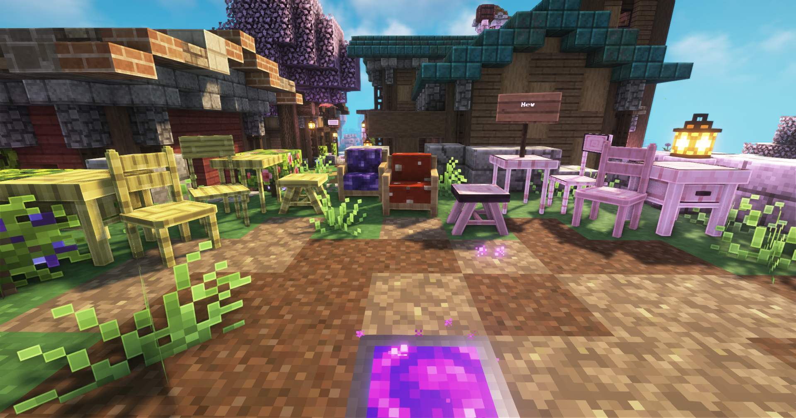

# Möbel/Dekorationen

Mit Möbeln und Dekorationen kannst du dein Haus, deinen Garten oder gleich dein ganzes Dorf dekorieren und gestalten. Sie dienen dir als sitz Möglichkeiten, Aufbewahrungsort oder einfach nur zur Dekoration. Um all diese Dinge herzustellen kannst du in deinen Heimatdorf den Dekoristen Npc suchen und bei Ihm gleich einige Möbel einkaufen. Alternativ lassen sich alle Dekoartikel auch in der Werkbank herstellen.

Um das Rezept für die Möbel zu finden suche dazu mit den unten stehenden Namen in der Werkbank. Oder suche direkt nach zb. - Eichenholzstuhl /tisch etc

```
Stichworte:  Stuhl / Tisch / Sofa / Desks / Deko
```

<mark style="background-color:green;">In Möbeln mit einer Schublade können Items wie in einer Kiste hinterlegt werden!</mark>


Wir empfehlen mit Optifine und oder Forge/Fabric zu spielen da es mit Clients zu ungewollten Bugs kommen **KANN**. Wir arbeiten aber kontinuierlich an Lösungen.


<figure><figcaption><p>Beispiel zur Suche der Möbel in der Werkbank.</p></figcaption></figure>

<figure><figcaption><p>Möbel aus den letzten Moon Expansion Update 1.19.4/z. 2 Wochen vor den 1.20 Update wurden bereits die Inhalte für das neue Minecraft Update auf Moonrealms hinzugefügt. So können Spieler stets Pünktlich zum realeas neue Features erwarten.</p></figcaption></figure>

